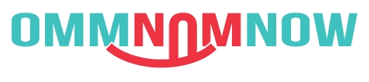

# FoodTruckHackathon: OmmNomNow

We believe that food brings people together and that supporting local businesses helps grow the community and local economy.  Therefore, since there are so many great food trucks in the area, we wanted to help people locate these trucks with these goals in mind.  We have designed this app, named OmmNomNow, to help people find their favorite eats and discover new tastes.

## What it does
This app shows the user food trucks near by.  These trucks can be viewed in a list of "cards" with images and relevant information such as the type of cuisine, sorted by closest distance.  Nearby trucks can also be viewed in a map with truck icons corresponding to their locations.

## What it looks like
 
  

  

   

-- The OmmNomNow HackFresno Team: Bryan Alvarado, Jonathan Castro, Victoria Fall, Daniel Nguyen
